# 🪞 Ayna AI — AI Destekli Günlük Uygulaması

> *"AI sorar, sen cevaplarsın — gerisini AI halleder."*

Ayna AI, "boş sayfa korkusunu" ortadan kaldıran Türkçe bir günlük asistanıdır. Her gün sana kişiselleştirilmiş bir soru sorar, sen kısa bir cevap yazarsın — AI bunu anlamlı bir günlük girişine dönüştürür.

---

## 🚀 Özellikler (v0.2.0)

- 🤖 **AI Dinamik Soru Motoru** — Geçmiş cevaplara göre kişiselleştirilmiş Türkçe sorular
- ✍️ **Metin Zenginleştirme** — Ham notlarını seçtiğin tonda (Neşeli / Hüzünlü / Minnettar / Motive / Sakin) anlamlı bir günlüğe dönüştürür, istersen AI'sız da kaydedebilirsin
- 📅 **Takvim Görünümü** — Giriş yaptığın günleri takvimde gör, geçmişine kolayca eriş
- 🔐 **Biyometrik Kilit** — FaceID / Parmak izi ile gizlilik garantisi
- ☁️ **Bulut Senkronizasyonu** — Verilerini kaybetme
- 🔔 **Akıllı Bildirim** — Günlük yazma alışkanlığı kazan

---

## 🛠️ Tech Stack

| Katman | Teknoloji |
|---|---|
| Mobil | Flutter (iOS + Android) |
| Backend | FastAPI (Python 3.11+) |
| Veritabanı | Supabase (PostgreSQL) |
| AI | Claude Haiku (claude-haiku-4-5) — vendor-agnostic yapı |
| Deploy | Render (Backend) + Netlify (Frontend Web) |

---

## 🌐 Canlı Demo

- **Web Uygulaması:** https://ayna-ai-yga.netlify.app
- **Backend API:** https://ayna-ai-backend.onrender.com
- **API Dokümantasyonu (Swagger):** https://ayna-ai-backend.onrender.com/docs

---

## 📁 Proje Yapısı

```
ai-gunluk/
├── prodocs/                   # Geliştirme referans dökümanları (PRD, plan, progress, tech-stack, design system)
├── docs/
│   └── ARCHITECTURE.md        # Mimari ve repo yapısı detayları
├── .cursorrules              # Cursor AI kuralları
├── screenshots/              # Ekran görüntüleri
│   ├── onboarding_0.png
│   ├── onboarding_1.png
│   ├── onboarding_2.png
│   ├── login.png
│   ├── home.png
│   ├── entry.png
│   ├── enrich.png
│   ├── mood.png
│   ├── success.png
│   ├── history.png
│   └── settings.png
├── backend/                  # FastAPI backend
│   ├── main.py               # Ana uygulama + /health endpoint
│   ├── ai_service.py         # AI katmanı (vendor-agnostic)
│   ├── constants.py          # Sabitler
│   ├── routers/              # API endpoint'leri
│   ├── requirements.txt
│   └── .env.example          # Ortam değişkeni şablonu
└── mobile/                   # Flutter frontend (web build ile deploy edilir)
    └── lib/
        ├── main.dart
        ├── screens/
        │   ├── splash_screen.dart
        │   ├── onboarding_screen.dart
        │   ├── login_screen.dart
        │   ├── home_screen.dart
        │   ├── entry_screen.dart
        │   ├── enrich_screen.dart
        │   ├── mood_screen.dart
        │   ├── success_screen.dart
        │   ├── history_screen.dart
        │   └── settings_screen.dart
        └── widgets/
```

---

## ⚙️ Kurulum ve Çalıştırma

### Gereksinimler
- Python 3.11+
- Flutter 3.41+
- Git

### Backend

```bash
cd backend
pip install -r requirements.txt
uvicorn main:app --reload --port 8080
```

Çalıştıktan sonra:
- **Health check:** http://localhost:8080/health
- **Swagger UI:** http://localhost:8080/docs

### Frontend (Mobil)

```bash
cd mobile
flutter pub get
flutter run            # bağlı Android cihaz veya emulator
flutter run -d chrome  # web
```

---

## 📄 Dokümantasyon

- [prodocs/PRD.md](./prodocs/PRD.md) — Ürün gereksinimleri, teknik mimari, API tasarımı
- [prodocs/MVP.md](./prodocs/MVP.md) — MVP kapsamı, Eisenhower matrisi, versiyonlama
- [prodocs/plan.md](./prodocs/plan.md) — 5 fazlı geliştirme planı
- [prodocs/progress.md](./prodocs/progress.md) — Geliştirme süreci kayıtları
- [prodocs/tech-stack.md](./prodocs/tech-stack.md) — Teknoloji seçimleri ve geliştirmede AI kullanımı
- [prodocs/DesignSystem.md](./prodocs/DesignSystem.md) — Renk paleti, tipografi, component kuralları
- [docs/ARCHITECTURE.md](./docs/ARCHITECTURE.md) — Mimari ve repo yapısı detayları

---

## 🎓 Hakkında

Bu proje **YGA Future Talent Programı — Modül 301 Bootcamp** kapsamında geliştirilmektedir.

**Geliştirici:** Abdullah Sait Avcı
**Üniversite:** Sakarya Üniversitesi, Bilgisayar Mühendisliği

---

## 📊 Durum

| Bileşen | Durum |
|---|---|
| PRD & MVP | ✅ Tamamlandı |
| Geliştirme Planı | ✅ Tamamlandı |
| Backend | ✅ Canlıda (Render) |
| Frontend Web | ✅ Canlıda (Netlify) |
| Supabase Kurulumu | ✅ Tamamlandı |
| AI Entegrasyonu | ✅ Tamamlandı (Claude Haiku) |
| Güvenlik (CORS, Rate Limit, Prompt Injection) | ✅ Tamamlandı |
| Takvim Görünümü | ✅ Tamamlandı |
| Auth (Google/Apple) | ⏳ v2'ye bırakıldı (demo modu aktif) |
| Play Store Beta | ⏳ Planlandı |
| Android Build | ✅ Tamamlandı (debug APK) |
| Mobil Test | ✅ Fiziksel cihazda test edildi |

## 📱 Ekran Görüntüleri

### Giriş Akışı
| Onboarding 1 | Onboarding 2 | Onboarding 3 |
|---|---|---|
| 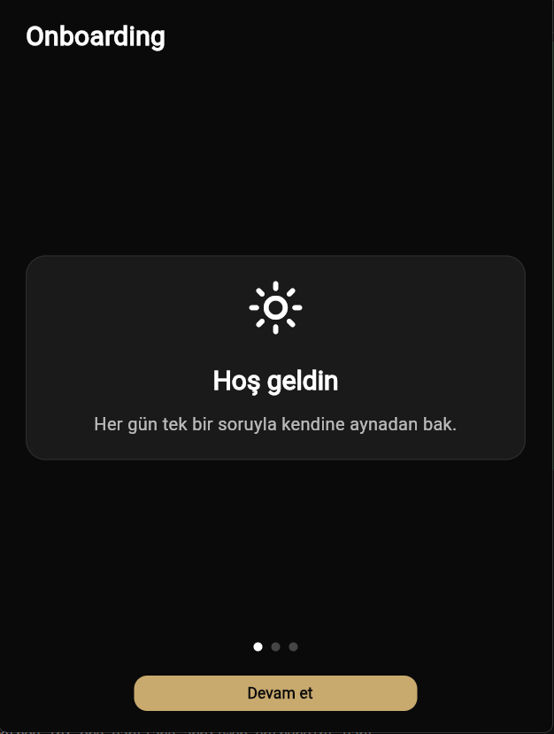 | 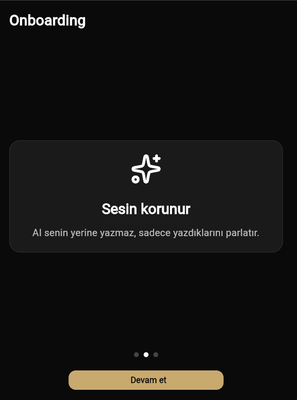 | 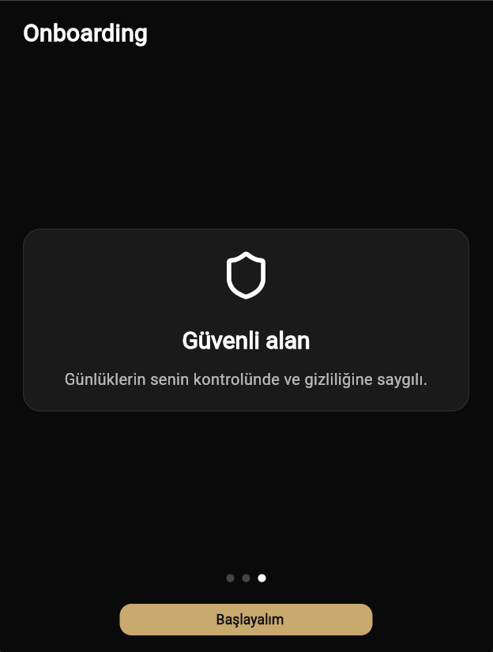 |

| Login | Home |
|---|---|
| 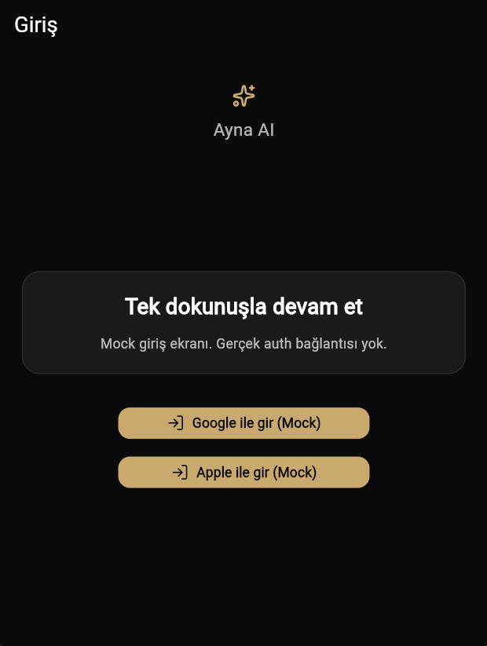 | 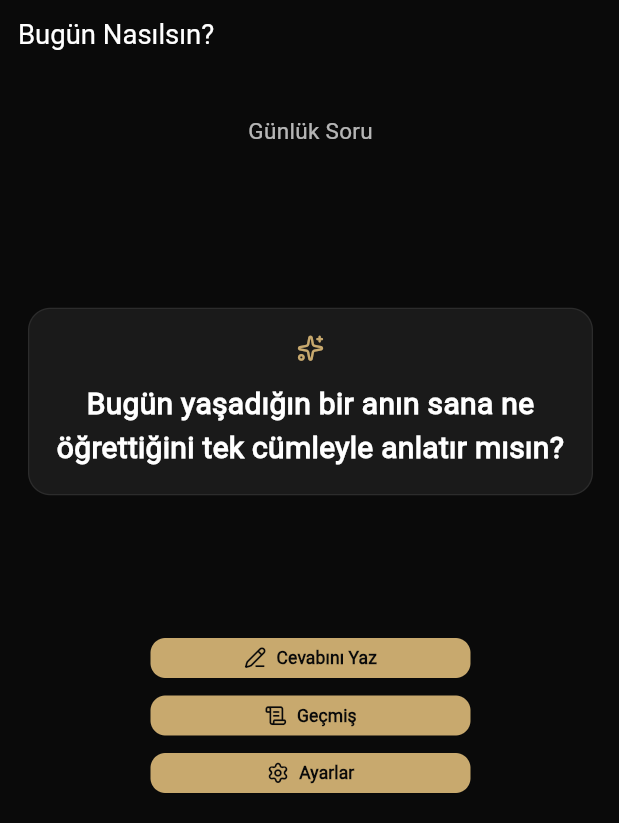 |

### Günlük Yazım Akışı
| Entry | Enrich | Mood |
|---|---|---|
| 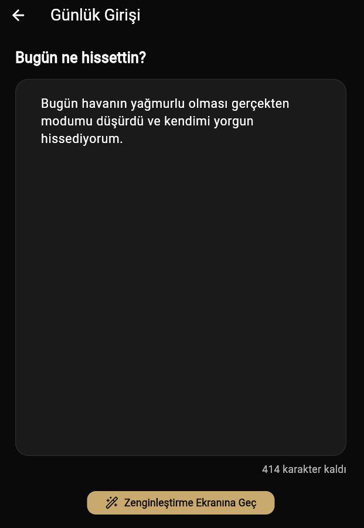 | 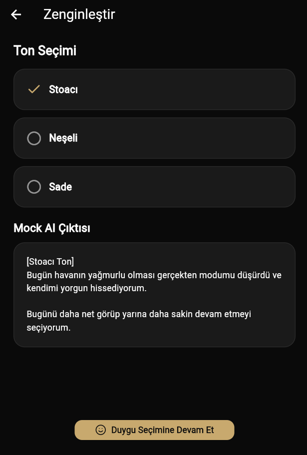 | 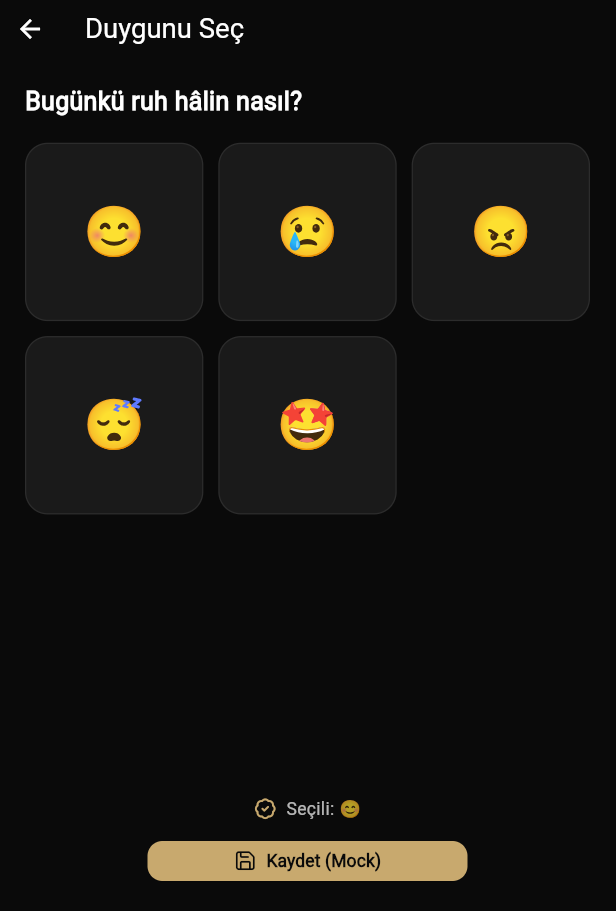 |

| Success |
|---|
| 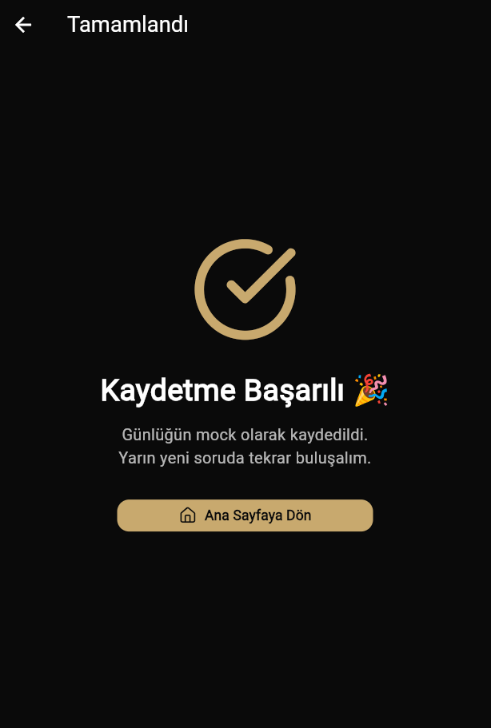 |

### Diğer
| History | Settings |
|---|---|
| 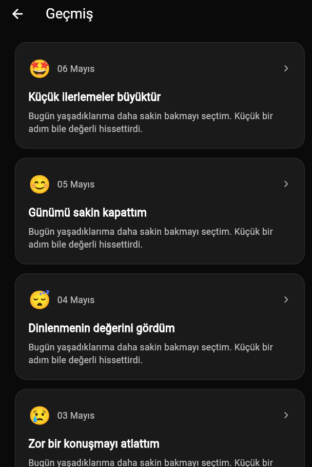 | 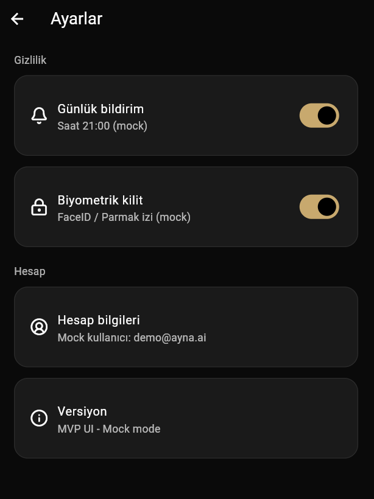 |